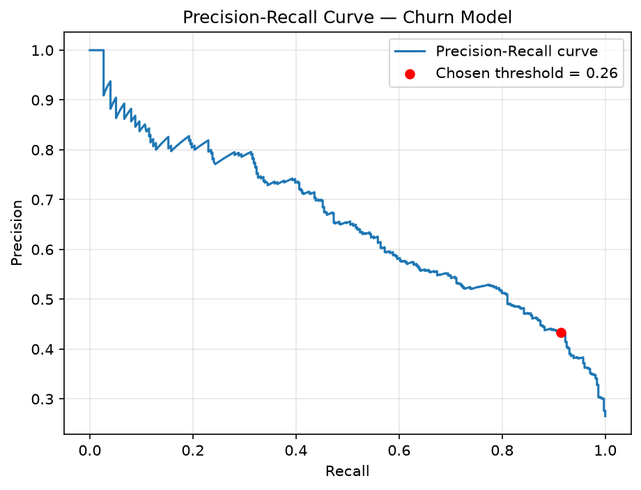

# 📊 Customer Churn Prediction System

## 🚀 Overview

Predicts whether a telecom customer will churn, using a full pipeline from
raw data to a deployable REST API: cleaning, imbalance-aware model
comparison, threshold tuning justified by a precision-recall curve, and a
tested FastAPI service.

**Live demo:** https://churn-ml-project-pu8t.onrender.com/docs

---

## 🎯 Problem Statement

Customer churn is a major cost center for telecom companies. The goal is to
flag customers likely to leave *before* they leave, so retention teams can
act on it — which makes recall on the churn class the metric that actually
matters, not overall accuracy.

---

## 💼 Business Impact

- Retaining an existing customer costs a fraction of acquiring a new one
- A missed churner (false negative) costs the full value of that customer
- A false positive costs a discount or outreach message to someone who
  wasn't leaving anyway
- That cost asymmetry is why this project optimizes for recall, not accuracy

---

## 🧠 Approach

1. Clean & preprocess telecom customer data
2. Compare Logistic Regression → Random Forest → XGBoost under different
   imbalance-handling strategies
3. Validate with 5-fold stratified cross-validation, not a single split
4. Pick a classification threshold from the precision-recall curve (F2-optimized)
   instead of the default 0.5
5. Serve the trained pipeline through a tested FastAPI endpoint

---

## ⚙️ Tech Stack

Python · Pandas · NumPy · Scikit-learn · XGBoost · FastAPI · pytest · Docker

---

## 📊 Model Comparison

All models evaluated on the same held-out test set, with class-imbalance
handling applied where noted (dataset is ~27% churn / 73% no-churn):

| Model | Imbalance Handling | Notes |
|---|---|---|
| Logistic Regression | None (baseline) | Reference point — high precision, weak recall |
| Logistic Regression | `class_weight='balanced'` | Recall improves, precision drops sharply |
| Random Forest | `class_weight='balanced'` | Better than LR, worse recall than XGBoost |
| **XGBoost** | `scale_pos_weight=3` | **Selected** — best recall/precision balance |

Full comparison code and outputs: [`notebooks/eda.ipynb`](notebooks/eda.ipynb).

---

## 📈 Model Performance

**5-fold stratified cross-validation** (full dataset, more reliable than a
single split):

| Metric | Mean | Std |
|---|---|---|
| Recall (churn class) | 0.774 | ± 0.016 |
| ROC-AUC | 0.840 | ± 0.011 |

**Held-out test set, at the tuned threshold:**

- Threshold: **0.26** (see rationale below)
- Recall (churn class): 0.91
- Precision (churn class): 0.43

Reproduce with: `python src/train.py`

---

## ⚖️ Threshold Strategy

The default 0.5 cutoff is arbitrary for an imbalanced, cost-asymmetric
problem. Instead, the threshold is chosen by scanning the precision-recall
curve and picking the point that maximizes **F2-score** — a metric that
weights recall twice as heavily as precision, matching the cost asymmetry
described above.



This selected **0.26**, close to an earlier hand-picked 0.3 — which confirms
the original instinct was reasonable, but it's now a data-driven choice
instead of a guess, and it's reproducible if the model is retrained on new
data (`src/train.py` regenerates both the threshold and this plot).

---

## 📉 Model Tradeoff

- Higher recall → more churners caught, more false alarms
- Lower precision → retention team spends effort on customers who weren't leaving
- Acceptable here because the cost of a false negative (lost customer) is
  materially higher than the cost of a false positive (one extra offer)

---

## 🔥 Key Insights

- Month-to-month contracts churn at a much higher rate than annual contracts
- Shorter-tenure customers are disproportionately likely to churn
- Electronic check payment correlates with higher churn — consistent with it
  being the payment method requiring the most active engagement

---

## 🌐 API Usage

### Endpoint

`POST /predict`

### Sample Request

```json
{
  "gender": "Male",
  "SeniorCitizen": 0,
  "Partner": "Yes",
  "Dependents": "No",
  "tenure": 12,
  "PhoneService": "Yes",
  "MultipleLines": "No",
  "InternetService": "Fiber optic",
  "OnlineSecurity": "No",
  "OnlineBackup": "Yes",
  "DeviceProtection": "No",
  "TechSupport": "No",
  "StreamingTV": "Yes",
  "StreamingMovies": "Yes",
  "Contract": "Month-to-month",
  "PaperlessBilling": "Yes",
  "PaymentMethod": "Electronic check",
  "MonthlyCharges": 70,
  "TotalCharges": 840
}
```

### Sample Response

```json
{
  "prediction": 1,
  "churn_probability": 0.7569,
  "threshold_used": 0.26
}
```

### cURL

```bash
curl -X POST http://127.0.0.1:8000/predict \
  -H "Content-Type: application/json" \
  -d '{"gender":"Male","SeniorCitizen":0,"Partner":"Yes","Dependents":"No","tenure":12,"PhoneService":"Yes","MultipleLines":"No","InternetService":"Fiber optic","OnlineSecurity":"No","OnlineBackup":"Yes","DeviceProtection":"No","TechSupport":"No","StreamingTV":"Yes","StreamingMovies":"Yes","Contract":"Month-to-month","PaperlessBilling":"Yes","PaymentMethod":"Electronic check","MonthlyCharges":70,"TotalCharges":840}'
```

---

## 🧪 Testing

```bash
pytest tests/ -v
```

12 tests covering: data cleaning edge cases (blank `TotalCharges` values),
pipeline correctness (valid probability outputs, unseen-category handling),
and the API surface (response shape, validation errors, prediction/threshold
consistency).

---

## 🚀 Local Setup

```bash
git clone https://github.com/omjarsaniya/churn-ml-project
cd churn-ml-project

python -m venv .venv
# Windows: .venv\Scripts\activate
# macOS/Linux: source .venv/bin/activate

pip install -r requirements.txt

# Train the model (writes models/pipeline.pkl and reports/precision_recall_curve.png)
python src/train.py

# Run the API
uvicorn app:app --reload
# Swagger UI: http://127.0.0.1:8000/docs
```

---

## 🐳 Deployment

```bash
docker build -t churn-api .
docker run -p 8000:8000 churn-api
```

Deployed on Render — see `Dockerfile` for the container build.

---

## 🧩 Project Structure

```text
src/
  paths.py         → central path config
  preprocess.py     → data cleaning
  pipeline.py       → preprocessing + model pipeline definition
  train.py          → cross-validation, threshold tuning, training
  predict.py        → manual sanity-check script
app.py              → FastAPI application
tests/              → pytest suite (preprocessing, pipeline, API)
notebooks/          → EDA + model comparison
models/             → saved pipeline (gitignored, generated by train.py)
reports/            → generated plots (gitignored, generated by train.py)
data/               → dataset
```

---

## 🎯 Key Learnings

- Compared multiple models under different imbalance-handling strategies
  rather than assuming XGBoost was correct by default
- Used cross-validation instead of trusting a single train/test split
- Derived the classification threshold from a precision-recall curve, tied
  to an explicit business cost argument, instead of picking a round number
- Wrote tests for both the ML pipeline and the API layer
- Kept preprocessing and model bundled in one `Pipeline` object specifically
  to prevent train/serve skew

---

## 🔮 Future Improvements

- SHAP-based explainability for individual predictions
- CI (GitHub Actions) running the test suite on every push
- Model monitoring / drift detection post-deployment

---

## 📄 License

This project is for educational purposes.

---

## 🎤 Author

**Om Jarsaniya**
